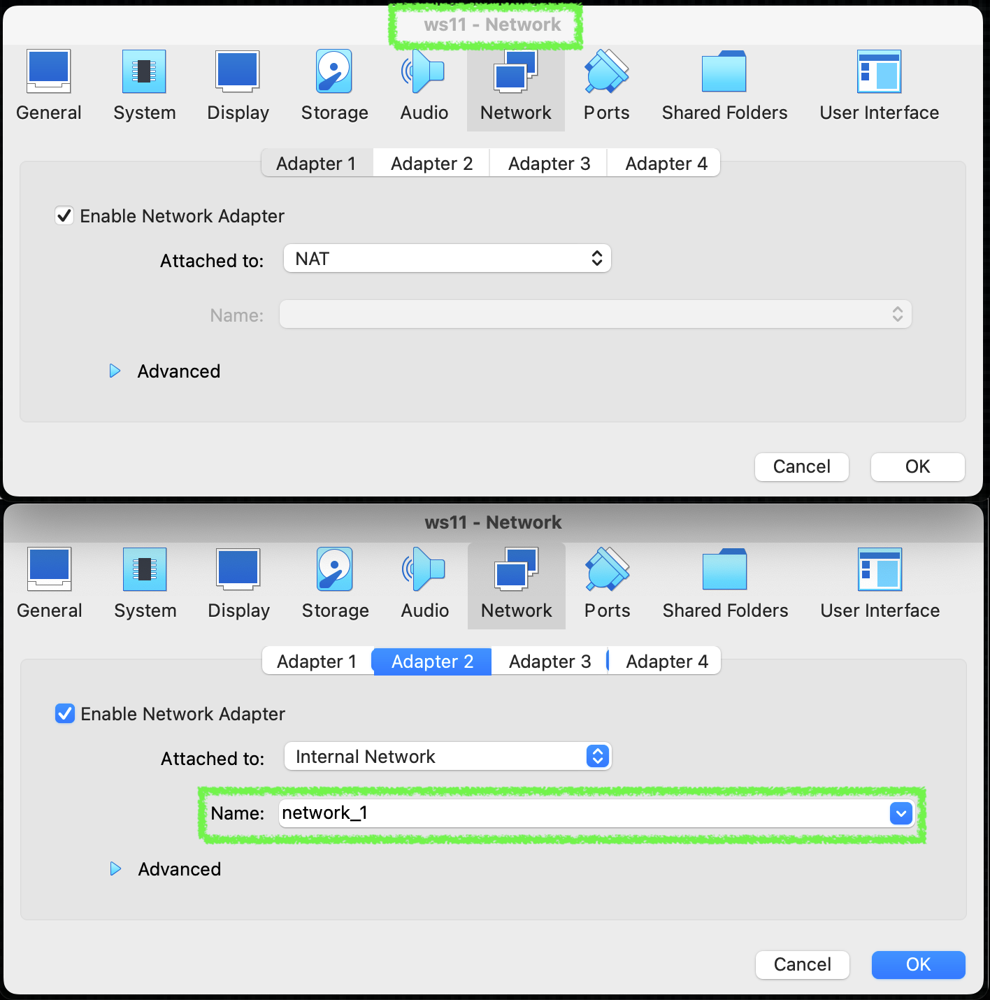
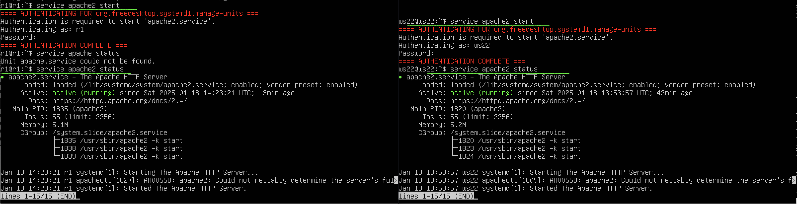
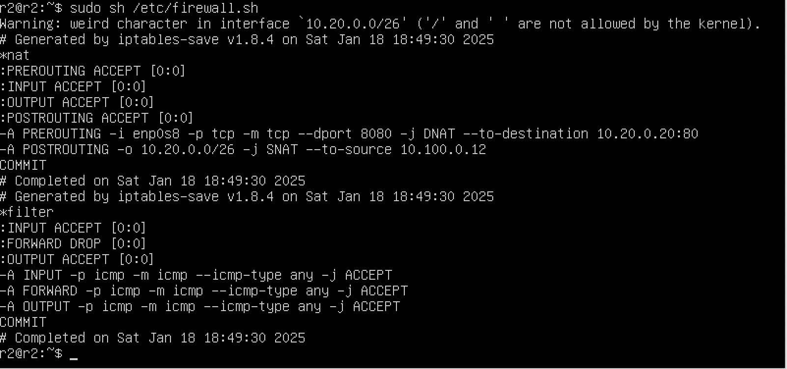

# Сети в Linux

В данном проекте представлена реализация настройки сетей в Linux на виртуальных машинах
В проекте используются такие инструменты как:
- ipcalc
- iperf3
- iptables
- iproute2
- traceroute
- протокол ICMP
- apache2
- dhcp
- snat/dnat
- ssh tunnels

## Contents

1. [Chapter I](#chapter-i)
2. [Chapter II](#chapter-ii) \
   2.1. [Стек протоколов TCP IP](#стек-протоколов-tcp-ip) \
   2.2. [Адресация](#адресация) \
   2.3. [Маршрутизация](#маршрутизация)
3. [Chapter III](#chapter-iii) \
   3.1. [Инструмент ipcalc](#part-1-инструмент-ipcalc) \
   3.2. [Статическая маршрутизация между двумя машинами](#part-2-статическая-маршрутизация-между-двумя-машинами) \
   3.3. [Утилита iperf3](#part-3-утилита-iperf3) \
   3.4. [Сетевой экран](#part-4-сетевой-экран) \
   3.5. [Статическая маршрутизация сети](#part-5-статическая-маршрутизация-сети) \
   3.6. [Динамическая настройка IP с помощью DHCP](#part-6-динамическая-настройка-ip-с-помощью-dhcp) \
   3.7. [NAT](#part-7-nat) \
   3.8. [Допополнительно. Знакомство с SSH Tunnels](#part-8-дополнительно-знакомство-с-ssh-tunnels)

## Part 1. Инструмент **ipcalc**

**== Задание ==**

##### Подними виртуальную машину (далее -- ws1)
виртуальная машина ws1 создана, запущена


#### 1.1. Сети и маски
установка ipcalc


##### Определи и запиши в отчёт:

#### 1) Адрес сети *192.167.38.54/13*
Узнаю информацию по адерсу сети


#### 2) Перевод маски *255.255.255.0* в префиксную и двоичную запись, */15* в обычную и двоичную, *11111111.11111111.11111111.11110000* в обычную и префиксную


**Перевод маски *255.255.255.0*:**

Двоичная запись:  11111111.11111111.11111111.00000000 (зеленым)

Префиксная запись: /24 

- чтобы посчитать префиксную запись нужно посчитать количество единиц в каждой октете и сложить их: 8 * 3 = /24


**Перевод  */15*:**

Обычная запись: 255.254.0.0

Двоичная запись: 11111111.11111110.00000000.00000000


**Перевод  *11111111.11111111.11111111.11110000*:**

Обычная запись: 255.255.255.240
Префиксная запись: /28

- переводим каждую октету из двоичного в десятичный формата


- чтобы посчитать префиксную запись нужно посчитать количество единиц в каждой октете и сложить их: 8 * 3 + 4 = /28

- через ipcalc узнаем информацию


##### 3) Минимальный и максимальный хост в сети *12.167.38.4* при масках: */8*, *11111111.11111111.00000000.00000000*, *255.255.254.0* и */4*

- ### сеть 12.167.38.4, маска */8*:

Hostmin: 12.0.0.1

Hostmax: 12.255.255.254


- ### сеть 11111111.11111111.00000000.00000000:

HostMin: 255.255.0.1

HostMax: 255.255.0.254

переводим в обычную запись: 255.255.0.0


- ### сеть 255.255.254.0: 

HostMin: 255.255.254.1

HostMax: 255.255.254.254


- ### сеть /4: 

HostMin: 240.0.0.1

HostMax: 240.0.0.254


#### 1.2. localhost

##### Определи и запиши в отчёт, можно ли обратиться к приложению, работающему на localhost, со следующими IP: *194.34.23.100*, *127.0.0.2*, *127.1.0.1*, *128.0.0.1*

Можно обратиться: 127.0.0.2, 127.1.0.1

проверяем каждый IP

### IP: 194.34.23.100


### IP: 127.0.0.2


### IP: 127.1.0.1


### IP: 128.0.0.1


Пакеты теряются у IP: 194.34.23.100, 128.0.0.1


#### 1.3. Диапазоны и сегменты сетей

##### Определи и запиши в отчёт:

##### 1) Какие из перечисленных IP можно использовать в качестве публичного, а какие только в качестве частных: *10.0.0.45*, *134.43.0.2*, *192.168.4.2*, *172.20.250.4*, *172.0.2.1*, *192.172.0.1*, *172.68.0.2*, *172.16.255.255*, *10.10.10.10*, *192.169.168.1*

Все IP-адреса протокола IPv4 делятся на публичные/глобальные/внешние (их называют "белые") — они используются в сети Интернет, и частные/локальные/внутренние (их называют "серые") — используются в локальной сети.

В связи с темчто "белых" IP-адресов существует ограниченное количество, а рост числа пользователей Интернета увеличивается, интернет-провайдеры всё чаще используют частные ("серые") IP-адреса, назначаемые абонентам.

Частные внутренние адреса не маршрутизируются в Интернете и на них нельзя отправить трафик из Интернета, они работают только в пределах локальной сети.
К частным "серым" адресам относятся IP-адреса из следующих подсетей:

От 10.0.0.0 до 10.255.255.255 с маской 255.0.0.0 или /8
От 172.16.0.0 до 172.31.255.255 с маской 255.240.0.0 или /12
От 192.168.0.0 до 192.168.255.255 с маской 255.255.0.0 или /16
От 100.64.0.0 до 100.127.255.255 с маской подсети 255.192.0.0 или /10; данная подсеть рекомендована согласно rfc6598 для использования в качестве адресов для CGN (Carrier-Grade NAT)

Это зарезервированные IP-адреса. Такие адреса предназначены для применения в закрытых локальных сетях, распределение таких адресов никем не контролируется.
Напрямую доступ к сети Интернет, используя частный IP-адрес, невозможен. В этом случае связь с Интернетом осуществляется через NAT (трансляция сетевых адресов заменяет частный IP-адрес на публичный). Частные IP-адреса в пределах одной локальной сети должны быть уникальны и не могут повторяться.

### Ответ: 

- Частные IP-адреса:

*10.0.0.45*

*192.168.4.2*

*172.20.250.4*

*172.16.255.255*

*10.10.10.10*


- Публичные IP-адреса:

*134.43.0.2*

*172.0.2.1*

*192.172.0.1*

*172.68.0.2*

*192.169.168.1*


##### 2) Какие из перечисленных IP-адресов шлюза возможны у сети *10.10.0.0/18*: *10.0.0.1*, *10.10.0.2*, *10.10.10.10*, *10.10.100.1*, *10.10.1.255*

Адресное пространство (англ. address space) — совокупность всех допустимых адресов

Опрелелим адресное пространство сети сеть 10.10.0.0/18


Сеть 10.10.0.0/18 имеет адресное пространство от 10.10.0.0 до 10.10.63.255.

- Ответ: 

*10.10.0.2*

*10.10.10.10*

*10.10.1.255*


## Part 2. Статическая маршрутизация между двумя машинами

**== Задание ==**

##### Подними две виртуальные машины (далее -- ws1 и ws2).


##### С помощью команды `ip a` посмотри существующие сетевые интерфейсы.

- сетевые интерфейсы первой виртульаной машины ws1 и машины ws2:


##### Опиши сетевой интерфейс, соответствующий внутренней сети, на обеих машинах и задай следующие адреса и маски: ws1 — *192.168.100.10*, маска */16*, ws2 — *172.24.116.8*, маска */12*. В отчёт помести скрины с содержанием изменённого файла *etc/netplan/00-installer-config.yaml* для каждой машины.

- открываю файл *etc/netplan/00-installer-config.yaml* для каждой машины


- редактирую файл 00-installer-config.yaml для каждой виртуальной машины


**Некоторые детали netplan чтобы освежить память:**

- https://www.dmosk.ru/miniinstruktions.php?mini=network-netplan

В данном случае `dhcp4: no` означает, что система не будет использовать DHCP (Dynamic Host Configuration Protocol) для автоматического получения IP-адреса и других сетевых настроек, таких как шлюз и DNS-серверы. Вместо этого, IP-адрес и другие параметры сети настроены статически вручную.

Если бы `dhcp4` было установлено на `yes`, система сама получала бы IP-адрес и другие параметры от DHCP-сервера в сети.


##### Выполни команду `netplan apply` для перезапуска сервиса сети.
- В отчёт помести скрин с вызовом и выводом использованной команды.


#### 2.1. Добавление статического маршрута вручную

чтобы успешно создать внутреннюю сеть, в настройках каждой виртуальной машины нужно указать, что будет сеть


##### Добавь статический маршрут от одной машины до другой и обратно при помощи команды вида `ip r add`.
через команду `ip r add <адрес с которым будем связывать> dev enp0s3` добавляем статический маршрут

- для ws1:

`sudo ip r add 172.24.116.8 dev enp0s3`

- для ws2:

`sudo ip r add 192.168.100.10 dev enp0s3`

проверяю, что статический маршрут добавлен на обеих машинах


##### Пропингуй соединение между машинами.

пингую соединение между машной ws1 и ws2 через команду `ping`


соединение установлено!

#### 2.2. Добавление статического маршрута с сохранением

##### Перезапусти машины.
выполняю ребут машин через `sudo reboot`


проверяю, что настройки из прошлого запуска сбросились через команду `ip r`


##### Добавь статический маршрут от одной машины до другой с помощью файла */etc/netplan/00-installer-config.yaml*.

редактирую файл */etc/netplan/00-installer-config.yaml* для машины ws1 и ws2
добавляю `routes`  — настройка маршрутов.
to - куда
via - откуда


обновляю настройки netplan
проверяю наличие маршрута


##### Пропингуй соединение между машинами.
пингую соединение между двумя машинами: 


успешно!

## Part 3. Утилита **iperf3**
**== Задание ==**

Iperf3 — кроссплатформенная консольная клиент-серверная программа — генератор TCP и UDP трафика для тестирования пропускной способности сети. С ее помощью довольно просто измерить максимальную пропускную способность сети между сервером и клиентом и провести нагрузочное тестирование канала связи.

#### 3.1. Скорость соединения
##### Переведи и запиши в отчёт: 8 Mbps в MB/s, 100 MB/s в Kbps, 1 Gbps в Mbps.

*8 Mbps = 1 MB/s

100 MB/s = 819200 Kbps

1 Gbps = 1000 Mbps*

#### 3.2. Утилита **iperf3**
##### Измерь скорость соединения между ws1 и ws2.

- https://help.reg.ru/support/vydelennyye-servery-i-dc/vmware-virtualnyy-data-tsentr/sozdaniye-i-nastroyka-virtualnykh-mashin/nastroyka-seti-virtualbox

- https://help.keenetic.com/hc/ru/articles/360010536580-%D0%A2%D0%B5%D1%81%D1%82%D0%B8%D1%80%D0%BE%D0%B2%D0%B0%D0%BD%D0%B8%D0%B5-%D0%BF%D1%80%D0%BE%D0%BF%D1%83%D1%81%D0%BA%D0%BD%D0%BE%D0%B9-%D1%81%D0%BF%D0%BE%D1%81%D0%BE%D0%B1%D0%BD%D0%BE%D1%81%D1%82%D0%B8-%D0%BB%D0%BE%D0%BA%D0%B0%D0%BB%D1%8C%D0%BD%D0%BE%D0%B3%D0%BE-%D0%BF%D0%BE%D0%B4%D0%BA%D0%BB%D1%8E%D1%87%D0%B5%D0%BD%D0%B8%D1%8F-%D1%81-%D0%BF%D0%BE%D0%BC%D0%BE%D1%89%D1%8C%D1%8E-iperf

Для того чтобы выполенить это задание сначала нужно скачать iperf3 на каждую виртуальную машину через команду `sudo apt install iperf3`

*Но если пытаться это сделать, не меняя настройки, ничего не получится, потому что в Part 2 я изменила настройки сети. Машины были настроены только на создание сети без возможности выхода в интернет. Чтобы это исправитьб необходимо:*
   - *выключить обе машины*
   - *добавить еще один адаптер для каждой машины, тем самым дать возможность выйти в интернет для загрузки iperf3*
   - первый порт на NAT, второй порт на Internal Network


Существует несколько способов как настроить сеть в VirtualBox, и каждый из них подходит лучше для решения одной задачи и меньше для другой. Основные:

**NAT** - этот способ используется по умолчанию. Для каждой машины создается отдельная внутренняя локальная сеть, в которой машина получает ip 10.10.0.1. Машина может связаться с интернетом, используя технологию NAT, и вы можете обратиться к машине, используя проброс портов VirtualBox, но если у вас будет две виртуальные машины, то вы уже не сможете между ними так взаимодействовать. И если из основной системы к гостевой можно обратиться, то к основной из гостевой уже никак не получится;

**Виртуальный адаптер хоста** - создается виртуальный сетевой адаптер, к которому можно подключить несколько виртуальных машин, тем самым объединив их в локальную сеть. Доступа к интернету нет, но зато машины находятся в одной сети и каждая имеет свой ip адрес, теперь они могут взаимодействовать между собой. Основная система тоже доступна по ip 192.168.56.1. Машины доступны не только между собой, но и из основной системы;

**Внутренняя сеть** - почти то же самое, что и виртуальный адаптер хоста, только без возможности доступа к виртуальной сети из основной системы, доступа к интернету нет.

После настройки запускаем вируальные машины и редактируем файл */etc/netplan/00-installer-config.yaml* в каждой виртуальной машине


Для того чтобы разобраться, какой адаптер отвечает за `enp0s3` и `enp0s8` в настройках сети виртуальной машины в VirtualBox, можно воспользоваться следующим подходом:

   - **Адаптер 1**: Может быть подключен к NAT, Bridge Adapter, Host-only Adapter и т.д.
   - **Адаптер 2**: Аналогично, может быть также настроен по-разному.

- Как правило, `enp0s3` — это адаптер, который соответствует первому сетевому адаптеру в настройках VirtualBox. Например, если он настроен на NAT, то это будет NAT-соединение.
- Адаптер `enp0s8` обычно будет соответствовать второму адаптеру, если он настроен (например, на Host-only или Bridged).


Чтобы подтвердить соответствие, использую команду `ip a`, чтобы увидеть, какие IP-адреса и состояния имеют сетевые интерфейсы. Это поможет точно определить, какой адаптер соответствует каждому интерфейсу.


После этого можно устанавливать `iperf3`


### iperf3

Для выполнения тестирования программа должна быть запущена на двух устройствах. Одно из них будет выполнять роль сервера, а другое роль клиента. Между ними и будет происходить передача данных для измерения пропускной способности соединения.

На машине, которая будет выступать в роли сервера (ws1), выполняю команду:

`iperf3 -s`

На компьютере, который выступает в роли клиента, для запуска тестирования выполняю команду:

`iperf3 -c <адрес_сервера_iperf3>`

iperf3 -c 192.168.100.10

На протяжении 10 секунд между этими хостами будет идти обмен трафиком, после чего соединение будет завершено и выведена информация с результатами теста.


## Part 4. Сетевой экран

`-` После соединения машин перед нами стоит следующая задача: контролировать информацию, проходящую по соединению. Для этого используются сетевые экраны.

**== Задание ==**


#### 4.1. Утилита **iptables**

- https://timeweb.cloud/tutorials/network-security/obzor-i-prakticheskoe-ispolzovanie-iptables

Iptables — популярная утилита командной строки для взаимодействия со встроенным в ядро Linux брандмауэром (он же firewall) под названием Netfilter, который включен в ядро Linux начиная с версии 2.4.

В своей работе Iptables использует механизм правил (rules). Правила контролируют входящий и исходящий трафики и состоят из цепочек, которые разрешают или блокируют трафик.

проверяю есть ли на виртуальных машинах утиллита через команду `sudo iptables --version`


##### Создай файл */etc/firewall.sh*, имитирующий файрвол, на ws1 и ws2:
```shell
#!/bin/sh

# Удаление всех правил в таблице «filter» (по умолчанию).
iptables -F
iptables -X
```

cоздаю файл  */etc/firewall.sh* на каждой машине:


- `iptables -F`: Эта команда очищает (удаляет все правила) из всех цепочек в таблице фильтрации, что эквивалентно сбросу всех правил. После выполнения этой команды, все пакеты будут приняты (если не настроены другие политики, такие как DROP или REJECT).

- `iptables -X`: Эта команда удаляет все пользовательские цепочки, которые были созданы в таблице фильтрации. Однако встроенные цепочки (например, INPUT, FORWARD, OUTPUT) останутся нетронутыми.


##### Нужно добавить в файл подряд следующие правила:
##### 1) На ws1 примени стратегию, когда в начале пишется запрещающее правило, а в конце пишется разрешающее правило (это касается пунктов 4 и 5).

##### 2) На ws2 примени стратегию, когда в начале пишется разрешающее правило, а в конце пишется запрещающее правило (это касается пунктов 4 и 5).

Пункт 1) 2) означают общее построние логики файла, просто порядок вызова команд основное задание в 4) 5)

##### 3) Открой на машинах доступ для порта 22 (ssh) и порта 80 (http).
##### 4) Запрети *echo reply* (машина не должна «пинговаться», т. е. должна быть блокировка на OUTPUT).
##### 5) Разреши *echo reply* (машина должна «пинговаться»).


`iptables -F`
- **-F**: флаг, который означает "Flush" (очистить). Эта команда очищает все правила из всех цепочек в текущей таблице фильтрации (по умолчанию, это таблица filter).

`iptables -X`
- **-X**: флаг, который означает "Delete User-Defined Chains" (удалить пользовательские цепочки). Эта команда удаляет все пользовательские цепочки, которые были созданы, но оставляет стандартные цепочки (INPUT, FORWARD, OUTPUT).

`iptables -A INPUT -p tcp -m multiport --dport 22,80 -s 192.168.100.10 -j ACCEPT`
- **-A INPUT**: флаг `-A` означает "Append" (добавить) и указывает, что правило будет добавлено в цепочку INPUT. Цепочка INPUT обрабатывает входящие пакеты.
- **-p tcp**: указывает, что правило применяется только к пакетам протокола TCP.
- **-m multiport**: "match multiport" - модуль, который позволяет использовать несколько портов в одном правиле.
- **--dport 22,80**: указывает, что правило применяется к пакетам, направленным на порты 22 (SSH) и 80 (HTTP).
- **-j ACCEPT**: указывает действие, которое будет выполнено для соответствующих пакетов. В данном случае, пакеты будут приняты.

`iptables -A OUTPUT -p icmp --icmp-type echo-reply -j ACCEPT`
- **-A OUTPUT**: добавляет правило в цепочку OUTPUT, которая обрабатывает исходящие пакеты.
- **-p icmp**: указывает, что правило применяется к пакетам протокола ICMP (Internet Control Message Protocol).
- **--icmp-type echo-reply**: уточняет, что правило применяется только к ответам на запросы (например, ответы на ping).

   --icmp-type echo-request используется для фильтрации запросов на проверки доступности.

   --icmp-type echo-reply используется для фильтрации ответов на эти запросы.

- **-j ACCEPT**: указывает, что данные пакеты будут приняты.
- **-j DROP**: указывает, что соответствующие пакеты будут отброшены, то есть не будут переданы дальше.


##### Запусти файлы на обеих машинах командами `chmod +x /etc/firewall.sh` и `/etc/firewall.sh`.

через команду `sudo iptables -L` смотрю все правила

- В отчёте опиши разницу между стратегиями, применёнными в первом и втором файлах.
### Ответ:
Стратегия ws1 начинается с блокировки. Это позволяет поставить жесткий контроль доступа, с возможностью его ослабления.
Стратегия ws2 дает возможность доступа сначала, но заканчивается контролем, что обеспечивает большую открытость с возможностью ограничения.

#### 4.2. Утилита **nmap**

Nmap («Network Mapper») - это утилита с открытым исходным кодом для исследования сети и проверки безопасности. Она была разработана для быстрого сканирования больших сетей, хотя прекрасно справляется и с единичными целями.

Выходные данные Nmap это список просканированных целей с дополнительной информацией по каждой из них в зависимости от заданных опций. Ключевой информацией является «таблица важных портов». Эта таблица содержит номер порта, протокол, имя службы и состояние. Состояние может иметь значение **open (открыт)**, **filtered (фильтруется)**, **closed (закрыт)** или **unfiltered (не фильтруется)**. Открыт означает, что приложение на целевой машине готово для установки соединения/принятия пакетов на этот порт. Фильтруется означает, что брандмауэр, сетевой фильтр, или какая-то другая помеха в сети блокирует порт, и Nmap не может установить открыт этот порт или закрыт. Закрытые порты не связаны ни с каким приложением, но могут быть открыты в любой момент. Порты расцениваются как не фильтрованные, когда они отвечают на запросы Nmap, но Nmap не может определить открыты они или закрыты.

##### Командой **ping** найди машину, которая не «пингуется», после чего утилитой **nmap** покажи, что хост машины запущен.
устанавливаю nmap на обе машины

команда ping для обеих машин


не пингуется вторая машина, но при этом хост запущен 


*Проверка: в выводе nmap должно быть сказано: `Host is up`*.

##### Сохрани дампы образов виртуальных машин

**P.S. Ни в коем случае не сохраняй дампы в гит!**


## Part 5. Статическая маршрутизация сети
**== Задание ==**

Сеть:


##### Подними пять виртуальных машин (3 рабочие станции (ws11, ws21, ws22) и 2 роутера (r1, r2)).

#### 5.1. Настройка адресов машин

Чтобы создать статическую маршрутизацию сети, нужно сначала изменить настройки в Virtual Box

### Настройка роутеров

Каждый роутер r1 и r2 поддерживает 2 сети:

r1: 
- 10.10.0.0/18
- 10.100.0.0/16

r2: 
- 10.100.0.0/16
- 10.20.0.0/26

Для этого добавим еще 2 адаптера, дадим имя для сети 

|  | 

### Настройка машин PC
Для машин делаем то же самое. Каждый хост соединен с одной сетью
ws11:
- 10.10.0.0/18

ws21:
- 10.100.0.0/16
- 10.20.0.0/26

ws22:
- 10.20.0.0/26

Для этого добавим по адаптеру каждому хосту еще один адаптер

|  |  | 


##### Настрой конфигурации машин в *etc/netplan/00-installer-config.yaml* согласно сети на рисунке.
После настройки адаптеров нужно посмотреть, какие сетевые интерфейсы нам доступны:

на хостах доступны enp0s3 и enp0s8: 


на роутерах мы добавляли 2 адаптера, поэтому там доступны enp0s3, enp0s8 и enp0s9


После этого можно редактировать *etc/netplan/00-installer-config.yaml* на каждой виртуальной машине.
Следуя плану на схеме добавляю сети для роутеров:


Добавляю сети для машин:


##### Перезапусти сервис сети. Если ошибок нет, командой `ip -4 a` проверь, что адрес машины задан верно. Также пропингуй ws22 с ws21. Аналогично пропингуй r1 с ws11.

Перезапуск сети можно сделать через команду  `sudo netplan apply`


Команда `ip -4 a` используется для отображения информации о сетевых интерфейсах и их адресах.
- `-4`: этот флаг указывает команде выводить только информацию об IPv4 адресах. 
Если нужна информация о IPv6 -- `-6`.
- `a`: сокращение от `address`, список всех сетевых интерфейсов и их IP-адресов.

Вместе `ip -4 a` выводит информацию о всех IPv4-адресах на доступных сетевых интерфейсах в системе.


Для проверки соединения пингуем машины **ws22 и ws21**:


Для проверки соединения пингуем машины **r1 с ws11**:


-------------------------------------------
дополнительно проверяю соединение между **r1 и r2**:


-------------------------------------------

#### 5.2. Включение переадресации IP-адресов

https://ru.linux-console.net/?p=9347

Переадресация IP-адресов (или IP forwarding) — это процесс, при котором маршрутизатор или устройство с включенной функцией IP forwarding принимает входящие IP-пакеты на одном сетевом интерфейсе и перенаправляет их на другой интерфейс. Это позволяет передавать данные между различными сетями или сегментами одной сети. 

1. **Маршрутизация**: Переадресация является ключевым элементом работы маршрутизаторов. Когда устройство получает пакет, оно проверяет его заголовок, определяет адрес назначения и решает, на какой интерфейс отправить пакет дальше.

2. **Сетевые среды**: Переадресация позволяет соединять разные сетевые среды, например, объединять локальную сеть с интернетом или двумя различными подсетями.

3. **Безопасность**: При этом может применяться NAT (Network Address Translation), что позволяет использовать частные IP-адреса внутри сети и скрывать их за единственным публичным IP-адресом при доступе в интернет.

4. **Управление трафиком**: Переадресация позволяет управлять сетевым трафиком и обеспечивать уровень качества обслуживания (QoS) для разного типа данных.

Включение переадресации в операционной системе (с помощью команды `sysctl -w net.ipv4.ip_forward=1`) делает сервер, на котором это настроено, возможным маршрутизатором.

Если сервер Linux действует как брандмауэр, маршрутизатор или устройство NAT, он должен иметь возможность пересылать пакеты, предназначенные для других пунктов назначения (кроме него самого). Linux использует переменную ядра **net.ipv4.ip_forward** для включения или выключения этого параметра.

И наоборот, переадресацию IP обычно следует отключать, если не используете одну из конфигураций. Обычно вы не хотите, чтобы ваша система тратила пропускную способность или ресурсы на пересылку пакетов куда-либо еще, если только она не предназначена для выполнения этой работы.

IP-пересылка также известна как маршрутизация. В Linux ее также можно называть Переадресация IP-адресов ядра, поскольку она использует переменную ядра net.ipv4.ip_forward для включения или отключения функции переадресации IP-адресов. Предустановленное значение по умолчанию — ip_forward=0. С

Проверка текущего статус IP-переадресации через команду `sysctl net.ipv4.ip_forward`


Параметр ядра net.ipv4.ip_forward равен 0. Это означает, что он выключен. Если бы для него было установлено значение 1, это означало бы, что он включен.

Этот параметр также можно просмотреть в файле /proc/sys/net/ipv4/ip_forward.

`cat /proc/sys/net/ipv4/ip_forward`


##### Для включения переадресации IP выполни команду на роутерах:

`sysctl -w net.ipv4.ip_forward=1`

*При таком подходе переадресация не будет работать после перезагрузки системы.*


##### Открой файл */etc/sysctl.conf* и добавь в него следующую строку. В отчёт помести скрин с содержанием изменённого файла */etc/sysctl.conf*.:
`net.ipv4.ip_forward = 1`


*При использовании этого подхода, IP-переадресация включена на постоянной основе.*


#### 5.3. Установка маршрута по умолчанию

Для изменения таблицы статической маршрутизации существует две команды: ip route и ip default-gateway. Первая используется для управления записями в таблице машрутизации; вторая – для установки шлюза по умолчанию.

Чтобы добавить новую запись в таблицу маршрутизации, следует задать сеть пункта назначения и либо шлюз, либо интерфейс. Можно также задать метрику. При добавлении в сеть нового маршрута используется сетевой IP-адрес с маской либо в стандартной, либо в компактной нотации.

**ip route {ip-address netmask | ip-address/prefix} {gateway | interface} [metric]**

Описание.  Добавление статического маршрута.
Префикс NO - Добавить, если нужно удаление статического маршрута.
Аргументы: 
- ip-address -IP-адрес сети пункта назначения.
- netmask -Маска сети пункта назначения (стандартная нотация).
- prefix - Длина маски сети пункта назначения (компактная нотация).
- gateway - IP-адрес шлюза.
- interface -Название и номер сетевого интерфейса.
- metric - Метрика.

Пример вывода команды `ip r` после добавления шлюза:
```
default via 10.10.0.1 dev eth0
10.10.0.0/18 dev eth0 proto kernel scope link src 10.10.0.2
```

##### Настрой маршрут по умолчанию (шлюз) для рабочих станций. Для этого добавь `default` перед IP-роутера в файле конфигураций.

В настройки Netplan необходимо добавить маршрут по умолчанию (шлюз) для того, чтобы рабочая станция знала, куда отправлять пакеты, адресованные за пределами своей сети.

Чтобы настроить маршрут по умолчанию, нужно добавить секцию routes с параметрами to: default и via: <IP-адрес роутера>. Это позволяет маршрутизировать весь трафик, адресованный в интернет или к другим сетям, через указанный роутер.

Когда вводится default перед IP-адресом роутера в файле конфигурации, это значит, что данный IP-адрес является маршрутом по умолчанию (шлюзом) для всех пакетов, которые не могут быть направлены в другое место. 

Для каждой виртуальной машины указан маршрут по умолчанию: 


##### Вызови `ip r` и покажи, что добавился маршрут в таблицу маршрутизации.
После добавления ip адреса по умолчанию и просмотра таблицы маршрутизации можно отметить, что добавился новый маршрут который соответствует адресу роутера


##### Пропингуй с ws11 роутер r2 и покажи на r2, что пинг доходит. Для этого используй команду: `tcpdump -tn -i eth0`

tcpdump – инструмент командной строки для анализа пакетов, который позволяет перехватывать сетевые пакеты на основе правил фильтрации, интерпретировать содержимое пакетов и отображать результат в удобочитаемом формате. 

`tcpdump [options] [expression]`
- Команда options позволяют вам контролировать поведение команды.
- Фильтр expression определяет какие пакеты будут захвачены


Для прослушивания конкретного сетевого интерфейса необходимо использовать опцию -i с именем интерфейса, передаваемого в качестве параметра. 
- t Не отображать метку времени в каждой строке.
- n Отображать IP-адрес вместо имени хоста.

`tcpdump -tn -i eth0`

Каждая строка включает:
- протокол (IP)
- имя или IP-адрес исходного хоста и номер порта (10.0.0.50.80)
- имя хоста или IP-адрес назначения и номер порта (10.0.0.1.53181)
- Флаги TCP (Flags [F.]). Указывают на состояние соединения и могут содержать более одного значения:
- Порядковый номер данных в пакете. (seq 1)
- Длина полезной нагрузки данных. (length 0)


#### 5.4. Добавление статических маршрутов


##### Добавь в роутеры r1 и r2 статические маршруты в файле конфигураций. Пример для r1 маршрута в сетку 10.20.0.0/26:

```shell
# Добавь в конец описания сетевого интерфейса eth1:
- to: 10.20.0.0
  via: 10.100.0.12
```

 | |


В конфигурации маршрутов маска не требуется для параметра `via`, потому что он указывает на IP-адрес следующего шлюза для маршрута.

В маршрутизации IP адреса представляют собой 32-битные значения, и когда указывается адрес в качестве следующего хопа, система напрямую использует этот адрес для передачи пакетов. Нет необходимости указывать маску, потому что маска используется для определения сети, а не для индивидуального адреса маршрутизатора.

- `to: 10.20.0.0/26` — здесь маска определяет, что этот маршрут относится ко всей подсети 10.20.0.0 с префиксом /26.
- `via: 10.100.0.12` — тут просто указывается конкретный адрес маршрутизатора, к которому нужно отправить пакеты в указанную подсеть, и для этого не требуется маска.

##### Вызови `ip r` и покажи таблицы с маршрутами на обоих роутерах. Пример таблицы на r1:
```
10.100.0.0/16 dev eth1 proto kernel scope link src 10.100.0.11
10.20.0.0/26 via 10.100.0.12 dev eth1
10.10.0.0/18 dev eth0 proto kernel scope link src 10.10.0.1
```


##### Запусти команды на ws11:

`ip r list 10.10.0.0/[маска сети]` и `ip r list 0.0.0.0/0`


- В отчёте объясни, почему для адреса 10.10.0.0/\[маска сети\] был выбран маршрут, отличный от 0.0.0.0/0, хотя он попадает под маршрут по умолчанию.

Маршрут 0.0.0.0/0 будет применен если других маршрутов в таблице маршрутизации хоста не будет.

- **10.10.0.0/18**: этот маршрут касается конкретной подсети и обозначает, что все пакеты, адресованные в диапазон 10.10.0.0 - 10.10.63.255, будут отправлены через интерфейс `enp0s8` с адресом `10.10.0.2`.
- **0.0.0.0/0**: это маршрут по умолчанию, который используется для всех IP-адресов, которые не попадают ни под один другой маршрут.

- Адрес 10.10.0.0/18 является более специфичным маршрутом по сравнению с маршрутом по умолчанию (0.0.0.0/0). Пакеты, адресованные в диапазон 10.10.0.0 - 10.10.63.255, могут быть обработаны маршрутизатором с использованием маршрута 10.10.0.0/18.
- Когда маршрутизатор получает пакет, он сначала ищет наиболее конкретный маршрут. В данном случае адрес назначения 10.10.0.0/18 попадает под этот специфичный маршрут, и он будет использован для передачи этих пакетов.


#### 5.5. Построение списка маршрутизаторов
Пример вывода утилиты **traceroute** после добавления шлюза:
```
1 10.10.0.1 0 ms 1 ms 0 ms
2 10.100.0.12 1 ms 0 ms 1 ms
3 10.20.0.10 12 ms 1 ms 3 ms
```

Утилита отслеживает, на какие узлы попадает сетевой пакет в процессе его передачи на целевой хост. По умолчанию используется UDP протокол – формируется UDP датаграмма, которая упаковывается в IP пакет. 

##### Запусти на r1 команду дампа:
`tcpdump -tnv -i eth0`

На r1 вызываем для сет интерфейса enp0s8, так как путь будем искать от ws11 а в роутере enp0s8 отвечает за ws11

|
|


##### При помощи утилиты **traceroute** построй список маршрутизаторов на пути от ws11 до ws21.

чтобы воспользоваться утиллитой **traceroute** ее нужно установить. Но сделать это не получится, так как дефолтный путь изменен: 


нужно удалить дефолтный путь на 1 сессию, чтобы можно было установить **traceroute** использую команду `sudo ip route delete default`


после этого необходимо перезагрузить машину чтобы восстановить дефолтный путь `sudo reboot`

Построение списка маршрутизаторв


- В отчёте, опираясь на вывод, полученный из дампа на r1, объясни принцип работы построения пути при помощи **traceroute**.

В одном из заголовков этого IP пакета утилита устанавливает значение параметра TTL (Time To Live) равным 1. Этот параметр используется для ограничения количества переходов от одного маршрутизатора к другому, т.е. позволяет избежать бесконечной передачи пакета между маршрутизаторами (например, в случае некорректно настроенного протокола динамической маршрутизации, или при ошибках в статических маршрутах). Каждый маршрутизатор, получив пакет, уменьшает значение TTL на 1 перед отправкой далее в сеть. В ситуации, когда после очередного уменьшения TTL становится равным 0 пакет считается недоставленным и отбрасывается, при этом маршрутизатор отвечает отправителю сообщением об ошибке.

При TTL = 1 traceroute, получая ответ от первого маршрутизатора, определяет его IP адрес и время, затраченное на обработку пакета. После этого TTL увеличивается на единицу для определения следующего маршрутизатора, и так далее до момента попадания пакета на целевой хост. Утилита использует указанный ей IP-адрес, и порт 34434 по умолчанию. Целевой хост принимает пакет, и отправляет сообщение о недоступности порта 34434 (так как в большинстве случаев он не используется каким-либо сервисом и закрыт). В итоге отслеживается вся цепочка следования пакета, которая завершается ответом от целевого хоста.

Анализируя время, затраченное на переход от одного маршрутизатора к другому, можно определить на каком из них возникает задержка – возможно из-за нехватки ресурсов на одном из серверов, или из-за неисправности дисковой системы, и др. Если один из серверов недоступен, то пакет не дойдет до целевого хоста, и утилита определит на каком этапе передачи это происходит. Также, пакет не дойдет если действует фильтрация трафика, мешающая передачи пакета.


#### 5.6. Использование протокола **ICMP** при маршрутизации
##### Запусти на r1 перехват сетевого трафика, проходящего через eth0 с помощью команды:
`tcpdump -n -i eth0 icmp`
##### Пропингуй с ws11 несуществующий IP (например, *10.30.0.111*) с помощью команды:
`ping -c 1 10.30.0.111`


##### Сохрани дампы образов виртуальных машин.
**P.S. Ни в коем случае не сохраняй дампы в гит!**


## Part 6. Динамическая настройка IP с помощью **DHCP**

https://antons-organization-1.gitbook.io/administrirovanie-linux/servisy-linux/protokol-dhcp/nastroika-dhcp-servera-isc-dhcp-server

##### Для r2 настрой в файле */etc/dhcp/dhcpd.conf* конфигурацию службы **DHCP**:
без утиллиты `isc-dhcp-server` файла dhcpd.conf не существует, поэтому, чтобы настроить конфигурацию, нужно сначала скачать утиллиту через `sudo apt install isc-dhcp-server`


##### 1) Укажи адрес маршрутизатора по умолчанию, DNS-сервер и адрес внутренней сети. Пример файла для r2:
```shell
subnet 10.100.0.0 netmask 255.255.0.0 {}

subnet 10.20.0.0 netmask 255.255.255.192
{
    range 10.20.0.2 10.20.0.50;
    option routers 10.20.0.1;
    option domain-name-servers 10.20.0.1;
}
```
|


**`subnet 10.100.0.0 netmask 255.255.0.0 {}`**:
   - Этот блок определяет подсеть с адресом 10.100.0.0 и маской подсети /16
   - Внутри фигурных скобок `{}` нет параметров, это значит, что в этой подсети DHCP-сервер не будет раздавать IP-адреса.

**`subnet 10.20.0.0 netmask 255.255.255.192`**:
   - Этот блок определяет подсеть с адресом 10.20.0.0 и маской подсети /26. Это обеспечивает 64 адреса (62 доступных для устройств, один адрес зарезервирован для сети, а другой для широковещательной рассылки).
   
**`range 10.20.0.2 10.20.0.50;`**:
   - В этом блоке указывается диапазон IP-адресов, которые могут быть выданы DHCP-сервером. **Сервер может назначать адреса от 10.20.0.2 до 10.20.0.50.**

**`option routers 10.20.0.1;`**:
   - Эта опция указывает основной маршрутизатор (шлюз) для устройств, получающих IP-адреса из данной подсети.

**`option domain-name-servers 10.20.0.1;`**:
   - Эта опция указывает адрес DNS-сервера, который будет использоваться клиентами.
   Любой сайт, доступный в глобальной сети, располагается на определенном физическом устройстве. Чтобы идентифицировать такое устройство в сети, ему назначается IP-адрес — идентификатор вида XXX.XXX.XXX.XXX.

Для открытия определенного сайта необходимо узнать IP-адрес девайса, на котором тот расположен.Любому IP-адресу назначается домен — простое и понятное имя. После ввода доменного имени в браузер:

Этот запрос переадресуется на DNS-сервер.
DNS-сервер анализирует доменное имя и трансформирует его в IP-адрес.
По IP-адресу устройство ищется во всемирной паутине.
Если оно найдено, запрос обрабатывается и возвращается ответ. В итоге пользователь видит запрошенный сайт.

##### 2) В файле *resolv.conf* пропиши `nameserver 8.8.8.8`.

Нахожу файл /etc/resolv.conf убираю *nameserver 127.0.0.53* и ставлю *nameserver 8.8.8.8*

|

##### Перезагрузи службу **DHCP** командой `systemctl restart isc-dhcp-server`. Машину ws21 перезагрузи при помощи `reboot` и через `ip a` покажи, что она получила адрес. Также пропингуй ws22 с ws21.

при первой попытке просто перезагрузить машину, у меня не добавился новый адрес который выдан dhcp, при вызове `ip -a` выводилось одно и тоже, потому что netplan не был изменен. Сначала нужно сделать на обеих машинах dhcp4: true, чтобы они могли получить новый адрес, выданный r2


Перезагружаю DHCP


Проверяю статус службы DHCP


Перезагружаю машину через `reboot`

На машине ws21 и ws22 вывожу результат команды ip a. Теперь новый адрес добавился


Чтобы проверить, какие адреса были назначены клиентам сервером DHCP, открываю машину, которая настроена как сервер DHCP, и ввожу:
`dhcp-lease-list`


пингую ws22 с ws21 на НОВЫХ адресах (на старых тоже)
[ping ws21 ws22 ](./screenshots/part_6/task_2/ping_new_old_addresses_dhcp.png)

##### Укажи MAC-адрес у ws11, для этого в *etc/netplan/00-installer-config.yaml* надо добавить строки: `macaddress: 10:10:10:10:10:BA`, `dhcp4: true`.

Добавляю MAC-адрес у ws11

|

применяю команду `sudo netplan apply`

выключаю машину, в настройках к адаптеру 2 добавляю mac-адрес

|

##### Для r1 настрой аналогично r2, но сделай выдачу адресов с жесткой привязкой к MAC-адресу (ws11). Проведи аналогичные тесты.

для r1 скачиваю dhcp сервер

|

настраиваю файл `/etc/dhcp/dhcpd.cong` и файл `/etc/resolv.conf`

|
|

перезагружаю ws11 через `reboot`
перезагружаю `systemctl restart isc-dhcp-server` и проверяю статус

|
|


на ws11 вывожу ip_a

|

пингую ws22 с ws21 

|

для проверки пингую с r1

|


##### Запроси с ws21 обновление IP-адреса.

Чтобы обновить IP-адрес на виртуальной машине с Linux, необходима команда dhclient, при настроенном DHCP.

IP до обновления


вызываю команду **`sudo dhclient -r`** чтобы освободить ip адрес


вызываю команду **`sudo dhclient`** чтобы присвоить новый ip адрес через dhcp


##### Сохрани дампы образов виртуальных машин.


**P.S. Ни в коем случае не сохраняй дампы в гит!**


## Part 7. **NAT**
- механизм преобразования адресов.

Apache HTTP Server, или просто Apache, — это один из самых популярных и широко используемых веб-серверов в мире. Веб-сервер — это программное обеспечение, которое отвечает за обработку запросов от клиентов (например, браузеров) и предоставление им веб-страниц, файлов и других ресурсов.

**== Задание ==**

чтобы воспользоваться **apache2** его нужно установить. Но сделать это не получится, так как дефолтный путь изменен. Необходимо удалить дефолтный путь на 1 сессию, чтобы можно было установить  **apache2**  использую команду `sudo ip route delete default`. Проверяю выход в интернет через 8.8.8.8


устанавливаю apache2 на r1 (на r1 нет дефолтного пути, поэтому можно скачивать без "заморочек")


##### В файле */etc/apache2/ports.conf* на ws22 и r1 измени строку `Listen 80` на `Listen 0.0.0.0:80`, то есть сделай сервер Apache2 общедоступным.


##### Запусти веб-сервер Apache командой `service apache2 start` на ws22 и r1.




##### Добавь в фаервол, созданный по аналогии с фаерволом из Части 4, на r2 следующие правила:
##### 1) Удаление правил в таблице filter — `iptables -F`;
##### 2) Удаление правил в таблице «NAT» — `iptables -F -t nat`;
##### 3) Отбрасывать все маршрутизируемые пакеты — `iptables --policy FORWARD DROP`.


##### Запусти файл также, как в Части 4.


##### Проверь соединение между ws22 и r1 командой `ping`.

*При запуске файла с этими правилами, ws22 не должна «пинговаться» с r1.*


##### Добавь в файл ещё одно правило:
##### 4) Разрешить маршрутизацию всех пакетов протокола **ICMP**.

http://www.rhd.ru/docs/manuals/enterprise/RHEL-4-Manual/security-guide/s1-firewall-ipt-fwd.html

- Разрешить все входящие ICMP-пакеты
- Разрешить все исходящие ICMP-пакеты
- Разрешить пересылку ICMP-пакетов (если устройство работает как маршрутизатор)

--icmp-type any разрешает все типы ICMP-сообщений (например, ping, эхо-ответы и т.д.).
Если нужно разрешить только определенные типы ICMP (например, только ping), используется конкретный тип:

sudo iptables -A INPUT -p icmp --icmp-type echo-request -j ACCEPT
sudo iptables -A OUTPUT -p icmp --icmp-type echo-reply -j ACCEPT


##### Запусти файл также, как в Части 4.

|

##### Проверь соединение между ws22 и r1 командой `ping`.

После изменения файла firewall.sh и запуска команды `chmod` и `sh` на r2 нужно было перезагрузить машину ws22 чтобы обновились настойки, только после этого снова получится сделать `ping`

*При запуске файла с этими правилами, ws22 должна «пинговаться» с r1.*


##### Добавь в файл ещё два правила:
порт - это логическая сущность, определяемая целым неотрицательным числом, которая позволяет создавать и поддерживать на одном узле несколько независимых соединений. Часть портов зарезервирована за типовыми службами: TCP 80 - это HTTP, а UDP 53 - DNS. Т.е. номер порта является дополнительным идентификатором, позволяющим отделять одни данные от других и направлять их нужным службам. TCP-сегмент или UDP-дейтаграмма также содержат заголовок и полезную нагрузку, заголовок также содержит два важных поля: порт источник (SRC PORT) и порт назначения (DST PORT).

##### 5) Включи **SNAT**, а именно маскирование всех локальных IP из локальной сети, находящейся за r2 (по обозначениям из Части 5 — сеть 10.20.0.0).
*Совет: стоит подумать о маршрутизации внутренних пакетов, а также внешних пакетов с установленным соединением.*

Маскарадинг — это метод обработки пакетов, при котором пакеты передаются через некоторую машину, работающую как шлюз. Эта машина при пересылке пакетов помечает их, чтобы знать, какой машине в сети вернуть полученный ответ. Таким образом, несколько машин из внутренней сети могут обращаться к внешней сети, а извне это будет выглядеть так, как будто обращения идут от той самой машины, являющейся шлюзом. Маскарадинг связан в первую очередь с NAT (Network Address Translation), пакеты при трансляции адресов маскируются, чтобы ответ вернулся именно к источнику запроса.


**`iptables -t nat -A POSTROUTING -o 10.20.0.0/26 -j SNAT --to-source 10.100.0.12`**

Эта команда настраивает правило в таблице nat (Network Address Translation) в iptables, которое изменяет исходный IP-адрес исходящих пакетов.

- -t nat — указывает, что правило применяется к таблице nat, которая отвечает за трансляцию сетевых адресов.
- -A POSTROUTING — добавляет правило в цепочку POSTROUTING. Эта цепочка обрабатывает пакеты после того, как они покидают систему (например, перед отправкой в сеть).
- -o 10.20.0.0/26 — указывает, что правило применяется только к пакетам, выходящим через интерфейс, который принадлежит сети 10.20.0.0/26.
- -j SNAT — указывает, что действие для этого правила — SNAT (Source NAT), то есть замена исходного IP-адреса пакета.
- --to-source 10.100.0.12 — задает новый исходный IP-адрес, на который будет заменен исходный адрес пакета. В данном случае это 10.100.0.12.

**Когда пакет выходит из системы через интерфейс, принадлежащий сети 10.20.0.0/26, его исходный IP-адрес заменяется на 10.100.0.12.**


##### 6) Включи **DNAT** на 8080 порт машины r2 и добавить к веб-серверу Apache, запущенному на ws22, доступ извне сети.
*Совет: стоит учесть, что при попытке подключения возникнет новое tcp-соединение, предназначенное ws22 и 80 порту.*

**`iptables -t nat -A PREROUTING -i enp0s8 -p tcp --dport 8080 -j DNAT --to-destination 10.20.0.20:80`**

- -A PREROUTING — добавляет правило в цепочку PREROUTING. Эта цепочка обрабатывает пакеты до того, как они будут маршрутизированы.
- -i enp0s8 — указывает, что правило применяется только к пакетам, приходящим на интерфейс enpose. Это имя сетевого интерфейса, через который поступают входящие соединения.
- -p tcp — указывает, что правило применяется только к TCP-пакетам (HTTP/HTTPS используют TCP).
- --dport 8080 — указывает, что правило применяется к пакетам, которые приходят на порт 8080.
- -j DNAT — указывает, что действие для этого правила — DNAT (Destination NAT), то есть замена адреса назначения пакета.
- --to-destination 10.20.0.20:80 — указывает новый адрес назначения, на который будет перенаправлен трафик. В данном случае это 10.20.0.20:80.

Все входящие TCP-соединения на порт 8080 через интерфейс enpose будут перенаправлены на IP-адрес 10.20.0.20 и порт 80.
Это позволяет внешним пользователям обращаться к веб-серверу Apache, запущенному на машине ws22 (с IP-адресом 10.20.0.20), через порт 8080 машины r2.

10.20.0.20 — это IP-адрес машины ws22, на которой запущен веб-сервер Apache.
Порт 80 — это стандартный порт для HTTP-трафика, на котором работает веб-сервер Apache.

Внешние пользователи обращаются к r2 на порт 8080.
r2 перенаправляет этот трафик на ws22 (10.20.0.20) на порт 80, где работает Apache.

в команде используется enp0s8 а не ip потому что

В команде iptables параметр -i (или --in-interface) используется для указания сетевого интерфейса, через который поступают пакеты. **Нельзя** указать конкретный IP-адрес вместо имени интерфейса, потому что:

- Параметр -i в iptables предназначен для фильтрации пакетов по входному интерфейсу, а не по IP-адресу. Это связано с тем, что iptables работает на уровне сетевых интерфейсов и пакетов, а не на уровне IP-адресов.


##### Запусти файл также, как в Части 4.
*Перед тестированием рекомендуется отключить сетевой интерфейс **NAT** (его наличие можно проверить командой `ip a`) в VirtualBox, если он включен.*


##### Проверь соединение по TCP для **SNAT**: для этого с ws22 подключиться к серверу Apache на r1 командой:
ws22 telnet 10.100.0.11 80
`telnet [адрес] [порт]`


##### Проверь соединение по TCP для **DNAT**: для этого с r1 подключиться к серверу Apache на ws22 командой `telnet` (обращаться по адресу r2 и порту 8080).

r1 telnet 10.100.0.12 8080


##### Сохрани дампы образов виртуальных машин.

**P.S. Ни в коем случае не сохраняй дампы в гит!**


## Part 8. Дополнительно. Знакомство с **SSH Tunnels**

- https://habr.com/ru/articles/331348/
- https://selectel.ru/blog/ssh-tunnels/


**== Задание ==**
##### Запусти на r2 фаервол с правилами из Части 7.


##### Запусти веб-сервер **Apache** на ws22 только на localhost (то есть в файле */etc/apache2/ports.conf* измени строку `Listen 80` на `Listen localhost:80`).


Ограничение доступа к веб-серверу только с локальной машины
Когда Apache настроен на прослушивание только на localhost:80, веб-сервер становится доступным только для локальных запросов (с того же компьютера, где он запущен). Это означает:

Запросы с других компьютеров в сети (например, по IP-адресу сервера) будут отклонены.

|
|


Разница между Remote TCP forwarding и Local TCP forwarding


##### Воспользуйся *Local TCP forwarding* с ws21 до ws22, чтобы получить доступ к веб-серверу на ws22 с ws21.

Local TCP Forwarding (локальное перенаправление портов) — это механизм, предоставляемый SSH, который позволяет безопасно перенаправлять сетевой трафик с локального компьютера на удаленный сервер через зашифрованный SSH-туннель. Он используется для решения различных задач, связанных с доступом к удаленным ресурсам, обходом ограничений и обеспечением безопасности.

Основное назначение Local TCP Forwarding:
- Доступ к удаленным сервисам, которые недоступны напрямую:

Некоторые сервисы (например, базы данных, внутренние веб-серверы) могут быть доступны только внутри локальной сети удаленного сервера и не иметь доступа извне.
С помощью Local TCP Forwarding можно "пробросить" порт такого сервиса на локальный компьютер и получить к нему доступ, как если бы он работал локально.

- Обход ограничений сети:
- Обеспечение безопасности:
SSH-туннель шифрует весь трафик между вашим локальным компьютером и удаленным сервером. Это особенно полезно, если идет работа с незащищенными протоколами (например, HTTP, FTP) или в ненадежных сетях (например, публичный Wi-Fi).

Как работает Local TCP Forwarding:

Устанавливается SSH-соединение с удаленным сервером и указывается, какой порт на локальном компьютере и какой порт на удаленном сервере нужно связать.
SSH создает зашифрованный туннель между локальным портом и удаленным сервисом.
Когда происходит подключение к локальному порту, трафик перенаправляется через SSH-туннель на удаленный сервер и далее на целевой сервис.


на ws22: **`ssh -L 8080:localhost:80 ws21@10.20.0.10`**
ssh -L *отправитель*:*куда в получателе*:*получатель*

На локальном компьютере открывается порт 8080.
Весь трафик, который поступает на этот порт, перенаправляется через SSH-туннель на удаленный сервер (10.20.0.10), то есть машину ws21
На удаленном сервере трафик перенаправляется на указанный адрес и порт (localhost:80).

Параметр localhost указывает адрес назначения на удаленном сервере. 

localhost относится к удаленному серверу (10.20.0.10), а не к локальному компьютеру.
Трафик, который поступает на локальный порт 8080, будет перенаправлен на localhost:80 на удаленном сервере.

ssh -L 8080:localhost:80 ws21@10.20.0.10

На локальном компьютере открывается порт 8080.
Когда подключились к localhost:8080 на локальном компьютере:
Трафик перенаправляется через SSH-туннель на удаленный сервер (10.20.0.10).
На удаленном сервере трафик перенаправляется на localhost:80.
Если на удаленном сервере (10.20.0.10) запущен веб-сервер, который слушает на localhost:80, человек получает доступ к этому веб-серверу через localhost:8080 на локальном компьютере.

- 8080 — локальный порт на ws22, который будет перенаправлен.
- localhost:80 — адрес и порт на ws21, куда будет перенаправляться трафик.
- ws21@10.20.0.10 — имя пользователя и адрес машины ws21.

После выполнения команды SSH-туннель будет установлен. Теперь весь трафик, отправленный на localhost:8080 на ws21, будет перенаправляться на ws22:80.


##### Воспользуйся *Remote TCP forwarding* c ws11 до ws22, чтобы получить доступ к веб-серверу на ws22 с ws11.

При попытке подключиться напрямую с машины ws11 на машину ws22 подключение не установится, поэтому подключение будет строиться через r2

- на машине ws11 подключаемся к машине r2
на ws11: **`ssh -L 8080:localhost:80 r2@10.20.0.1`**


- на машине r2 (которая открыта на ws11) открываем ws22
на r2: **`ssh -L 8080:localhost:80 ws22@10.20.0.20`**


- -R - создается обратный туннель (remote port forwarding). Порт на удаленном сервере будет перенаправлен на порт на локальной машине.

- 8080 — порт на удаленной машине (в данном случае 10.20.0.20), который будет открыт для доступа.
- 10.20.0:80 — адрес и порт на локальной машине, куда будет перенаправляться трафик. Здесь:

  - 10.20.0.1 — это IP-адрес локальной машины в локальной сети.
  - 80 — порт на локальной машине, куда будет перенаправляться трафик.
  - ws22@10.20.0.20 - адрес удаленного сервера, к которому идет подключение.

Команда создает туннель, который перенаправляет трафик с порта 8080 на удаленном сервере (10.20.0.20) на порт 80 на локальной машине (или в сети, доступной с локальной машины, например, 10.20.0).


##### Для проверки, сработало ли подключение в обоих предыдущих пунктах, перейди во второй терминал (например, клавишами Alt + F2) и выполни команду:

`telnet 127.0.0.1 [локальный порт]`
Для первой части задания 


Для второй части задания


##### Сохрани дампы образов виртуальных машин.


**P.S. Ни в коем случае не сохраняй дампы в гит!**